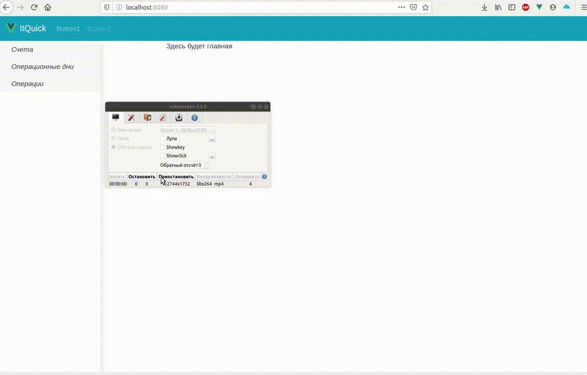

## Задание
Разработка прототипа маленького фронтального приложения.

## Условия

- Разрабатывается только фронтальная часть.
- Серверная эмулируется.
- Необходимо использовать vuex и vue-router.

> Акцент не на изящное представление, а на понимание структуры данных и компоновку приложения. Достаточно сделать один пункт меню, остальное рассказать.

	
<b>Модель данных. Модель представлена 4 объектами:</b>

1. Счет - Acct. Поле AcctNum – номер счета.
1. Остаток по счету на дату – AcctPos.  Поля:
    1. AcctNum – номер счета. Связь с объектом счет.
    1. OpDate – дата
    1. Balance – остаток. Остаток может быть положительный(активный) и отрицательный(пассивный)
1. Проводка – OpEntry. Поля:
    1. OpDate – дата
    1. AcctNumDb – счет дебета. Связь с объектом счет.
    1. AcctNumCr – счет кредита. Связь с объектом счет.
    1. Amount – сумма проводки
1. Опердень – OpDate. Поле OpDate – дата.

	
<b>Требование к фронтальной части.</b>

1. Экран приложения состоит из двух частей – Меню и Рабочей области. 
1. Меню состоит из следующих пунктов.
    1. Счета.
    1. Операционные дни.
    1. Операции.
1. При выборе пункта меню «Счета» в рабочая область должны отразиться.
    1. Табличная форма «Счета с остатками на дату». Отображает все счета с остатком на выбранную пользователем дату. По умолчанию это дата последнего опердня. 
    1. Табличная форма «Проводки по счету». Табличная форма проводок по счету связана со строками по табличной формы счетов. При выборе строки в форме «Счета», в форме «Проводки по счету» должны отражаться проводки, соответствующие счету.
1. При выборе пункта меню «Операционные дни» в рабочая область должны отразиться.
    1. Табличная форма «Операционные дни». Отображает все опердни.
    1. Табличная форма «Проводки операционного дня». По аналогии с пунктом «счета» записи формы «Проводки операционного дня» зависят от выбранной записи в форме «Операционных дней».
1. При выборе пункта меню «Операции» в рабочая область должны отразиться.
    1. Табличная форма «Проводки». Отображает все проводки.
    1. Табличная форма «Счета проводок». Должны быть отображены счет дебета и счет кредита с остатком на дату проводки. По аналогии с пунктом «счета» записи формы «Счета» зависят от выбранной записи в форме «Проводки».	
1. Данные  в формате JSON приведены в разделе «Приложение. Данные в формате JSON» .

	
<b>Общие требования ко всем табличным формам.</b>

Необходимо реализовать функции, позволяющие выполнить операции CRUD.
1. Отражать детальную информацию по записи (просмотр).
1. Редактирование строки.
1. Удаление строки.
1. Создание новой записи.

	
<b>Детальное описание табличных форм.</b>

1. Форма «Счета».
    1. Поле выбора опердня
    1. Колонка «номер счета».
    1. Колонка «остаток».
1. Форма «Проводки по счету».
    1. Колонка «Дата операционного дня».
    1. Колонка «Счет дебета».
    1. Колонка «Счет кредита».
    1. Колонка «Сумма».
1. Форма «Операционные дни».
    1. Колонка «Дата операционного дня».
1. Форма «Проводки операционного дня».
    1. Колонка «Счет дебета».
    1. Колонка «Счет кредита».
    1. Колонка «Сумма».
1. Форма «Проводки».
    1. Колонка «Дата операционного дня».
    1. Колонка «Счет дебета».
    1. Колонка «Счет кредита».
    1. Колонка «Сумма».
1. «Счета проводок».
    1. Колонка «номер счета».
    1. Колонка «остаток».
    1. В этой табличной форме всегда 2 записи – счет дебета проводки и счет кредита.

	
Приложение. Данные в формате JSON.

	https://github.com/webgrishin/itquick/tree/master/src/store/db

## Результат:

